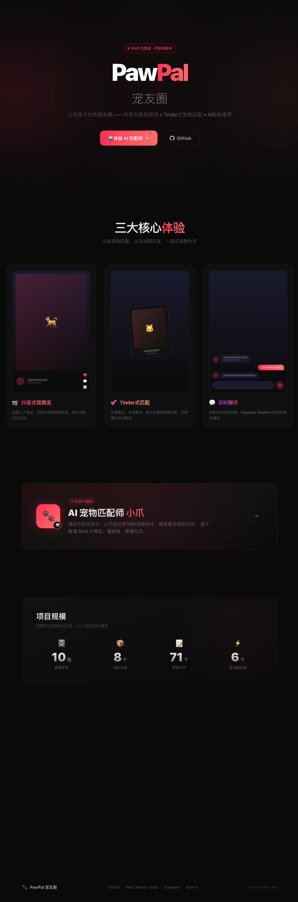
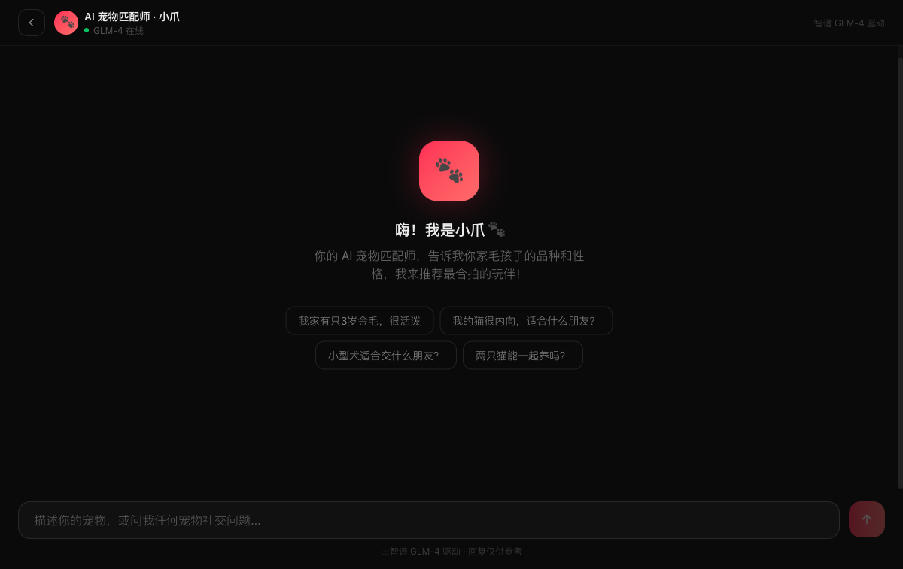
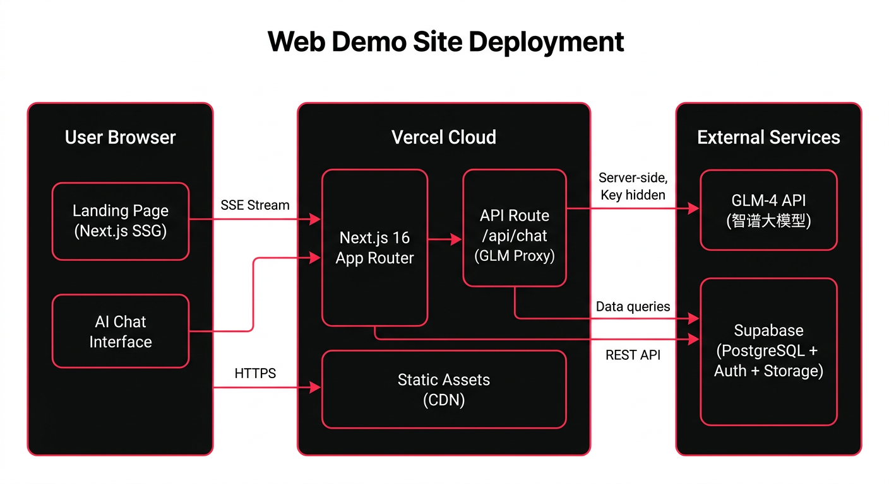
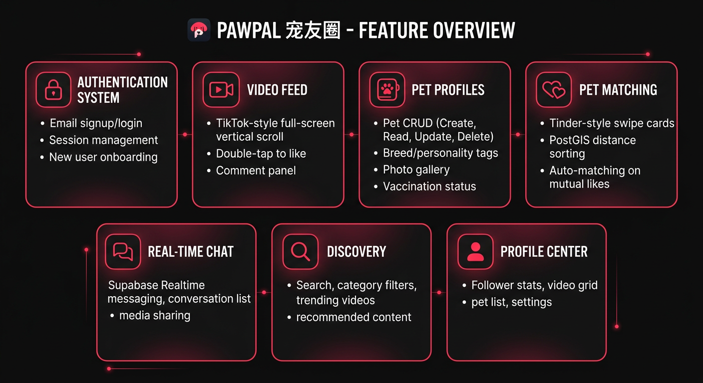
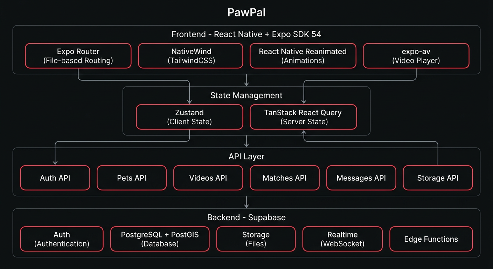
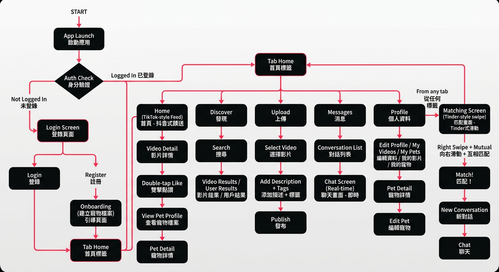
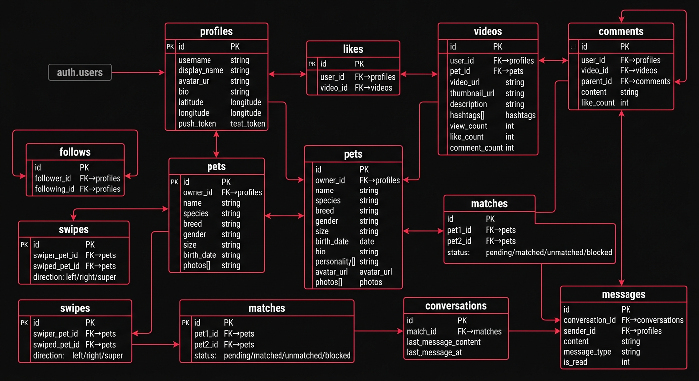

# PawPal 宠友圈

一款专为宠物设计的社交 App，参考抖音的 UI 风格，核心理念是宠物交友。

**🌐 在线体验**: [pet.rxcloud.group](https://pet.rxcloud.group) | **📦 源码**: [github.com/ava-agent/dog-agent](https://github.com/ava-agent/dog-agent)

## 项目概述

| 项目信息 | 详情 |
|---------|------|
| **名称** | PawPal 宠友圈 |
| **版本** | 1.0.0 |
| **平台** | iOS / Android / Web (体验站) |
| **移动端** | React Native + Expo SDK 54 |
| **体验站** | Next.js 16 + Vercel |
| **后端** | Supabase |
| **AI** | 智谱 GLM-4 |

## 在线体验站





### 体验站架构



体验站基于 **Next.js 16** 构建，部署于 Vercel，包含：
- **首页** — 品牌展示、功能演示、技术架构、项目数据
- **AI 宠物匹配师** — GLM-4 驱动的智能宠物顾问，流式对话体验

## 功能总览



| 模块 | 功能 | 状态 |
|------|------|------|
| **认证系统** | 邮箱注册/登录、新手引导 | ✅ 完成 |
| **视频信息流** | 抖音式全屏上下滑动、双击点赞、评论面板 | ✅ 完成 |
| **宠物档案** | 宠物CRUD、品种/性格标签、照片墙 | ✅ 完成 |
| **宠物匹配** | Tinder式左右滑动、PostGIS距离排序、自动配对 | ✅ 完成 |
| **即时通讯** | Supabase Realtime实时聊天 | ✅ 完成 |
| **发现页** | 搜索、分类筛选、热门视频 | ✅ 完成 |
| **个人中心** | 粉丝统计、作品网格、宠物列表 | ✅ 完成 |

## 技术架构



| 层级 | 技术 | 用途 |
|------|------|------|
| 前端框架 | React Native + Expo SDK 54 | 跨平台移动开发 |
| 路由 | Expo Router | 文件式路由 |
| 样式 | NativeWind (TailwindCSS) | 原子化样式 |
| 动画 | React Native Reanimated | 流畅动画 |
| 客户端状态 | Zustand | 轻量状态管理 |
| 服务端状态 | TanStack React Query | 数据请求与缓存 |
| 后端 | Supabase | Auth + DB + Storage + Realtime |

## 用户流程



## 数据库设计



### 核心表

| 表名 | 说明 | 主要字段 |
|------|------|---------|
| `profiles` | 用户档案 | username, avatar_url, latitude, longitude |
| `pets` | 宠物信息 | name, species, breed, personality[], photos[] |
| `videos` | 视频内容 | video_url, hashtags[], like_count, comment_count |
| `likes` | 点赞记录 | user_id, video_id |
| `comments` | 评论 (支持嵌套) | user_id, video_id, parent_id, content |
| `follows` | 关注关系 | follower_id, following_id |
| `swipes` | 滑动记录 | swiper_pet_id, swiped_pet_id, direction |
| `matches` | 配对记录 | pet1_id, pet2_id, status |
| `conversations` | 会话 | match_id, last_message_content |
| `messages` | 聊天消息 | conversation_id, sender_id, content, is_read |

### 自动触发器

- 新用户注册 → 自动创建 profile
- 互相右滑 → 自动创建 match 和 conversation
- 点赞/评论 → 自动更新计数器
- 发送消息 → 自动更新会话最后消息

### 存储桶

| 桶名 | 用途 | 大小限制 |
|------|------|---------|
| `avatars` | 用户头像 | 5MB |
| `pet-photos` | 宠物照片 | 10MB |
| `videos` | 视频文件 | 100MB |
| `thumbnails` | 视频缩略图 | 5MB |
| `chat-media` | 聊天媒体 (私有) | 20MB |

## 项目结构

```
dog-agent/
├── app/                          # Expo Router 页面
│   ├── _layout.tsx               # 根布局 (Auth Guard)
│   ├── index.tsx                 # 入口重定向
│   ├── (auth)/                   # 认证页面组
│   │   ├── _layout.tsx
│   │   ├── login.tsx             # 登录
│   │   ├── register.tsx          # 注册
│   │   └── onboarding.tsx        # 创建宠物档案
│   ├── (tabs)/                   # 底部 Tab 页面组
│   │   ├── _layout.tsx
│   │   ├── index.tsx             # 首页 - 视频流
│   │   ├── discover.tsx          # 发现
│   │   ├── upload.tsx            # 上传视频
│   │   ├── messages.tsx          # 消息列表
│   │   └── profile.tsx           # 个人中心
│   ├── matching/index.tsx        # 宠物匹配 (Tinder 式)
│   ├── chat/[matchId].tsx        # 聊天页面
│   ├── pet/[id].tsx              # 宠物详情
│   └── video/[id].tsx            # 视频详情 (Modal)
├── components/
│   ├── ui/                       # 基础 UI 组件
│   │   ├── Avatar.tsx
│   │   ├── Button.tsx
│   │   ├── LoadingSpinner.tsx
│   │   └── EmptyState.tsx
│   ├── feed/                     # 视频流组件
│   │   ├── VideoCard.tsx
│   │   └── CommentSheet.tsx
│   ├── matching/                 # 匹配组件
│   │   ├── SwipeCard.tsx
│   │   └── MatchModal.tsx
│   └── chat/                     # 聊天组件
│       ├── MessageBubble.tsx
│       ├── MessageInput.tsx
│       └── ConversationItem.tsx
├── hooks/                        # 自定义 Hooks
│   ├── useAuth.ts
│   ├── useVideos.ts
│   ├── useMessages.ts
│   └── useLocation.ts
├── stores/                       # Zustand 状态
│   ├── authStore.ts
│   ├── feedStore.ts
│   ├── matchingStore.ts
│   └── chatStore.ts
├── lib/
│   ├── supabase.ts               # Supabase 客户端
│   ├── queryClient.ts            # React Query 配置
│   ├── api/                      # API 层
│   │   ├── auth.ts
│   │   ├── pets.ts
│   │   ├── videos.ts
│   │   ├── matches.ts
│   │   ├── messages.ts
│   │   └── storage.ts
│   └── utils/                    # 工具函数
│       ├── formatNumber.ts
│       └── formatDate.ts
├── types/
│   └── database.ts               # 数据库类型定义
├── constants/
│   ├── config.ts                 # 应用配置
│   └── theme.ts                  # 主题常量
├── supabase/
│   └── migrations/               # 8 个 SQL 迁移文件
└── docs/                         # 项目文档
    ├── PROGRESS.md
    ├── IOS_DEPLOYMENT.md
    └── images/                   # 架构图示
```

## 快速开始

### 1. 安装依赖

```bash
npm install
```

### 2. 配置环境变量

创建 `.env` 文件：

```env
EXPO_PUBLIC_SUPABASE_URL=https://your-project.supabase.co
EXPO_PUBLIC_SUPABASE_ANON_KEY=your-anon-key
```

### 3. 初始化数据库

在 Supabase Dashboard 的 SQL Editor 中依次执行 `supabase/migrations/` 中的 8 个 SQL 文件：

1. `001_create_profiles.sql` - 用户档案表 + 自动创建触发器
2. `002_create_pets.sql` - 宠物表 + 自定义枚举类型
3. `003_create_videos.sql` - 视频表 + GIN 索引
4. `004_create_social.sql` - 点赞/评论/关注 + 计数触发器
5. `005_create_matching.sql` - 滑动/匹配 + 自动配对触发器
6. `006_create_messaging.sql` - 消息表 + 会话自动创建
7. `007_create_storage.sql` - 存储桶配置
8. `008_matching_rpc.sql` - 匹配推荐 RPC (Haversine 距离)

### 4. 启动开发服务器

```bash
npx expo start
```

用 iPhone 扫描二维码在 Expo Go 中打开。

## iOS 发布

### 快速发布

```bash
# 安装 EAS CLI
npm install -g eas-cli
eas login

# Ad-Hoc 内测
eas device:create
eas build --platform ios --profile preview

# TestFlight
eas build --platform ios --profile production
eas submit --platform ios --profile production --latest
```

详见 [iOS 发布完整指南](./docs/IOS_DEPLOYMENT.md)。

## 技术栈版本

| 依赖 | 版本 |
|------|------|
| expo | ~54.0.33 |
| react | 19.1.0 |
| react-native | 0.81.5 |
| @supabase/supabase-js | ^2.97.0 |
| @tanstack/react-query | ^5.90.21 |
| zustand | ^5.0.11 |
| nativewind | ^4.2.2 |
| react-native-reanimated | ~4.1.1 |

## 文件统计

- **总文件数**: 71
- **TypeScript 错误**: 0
- **数据库迁移**: 8
- **SQL 触发器**: 5
- **RLS 策略**: 全表覆盖

## 许可证

MIT
